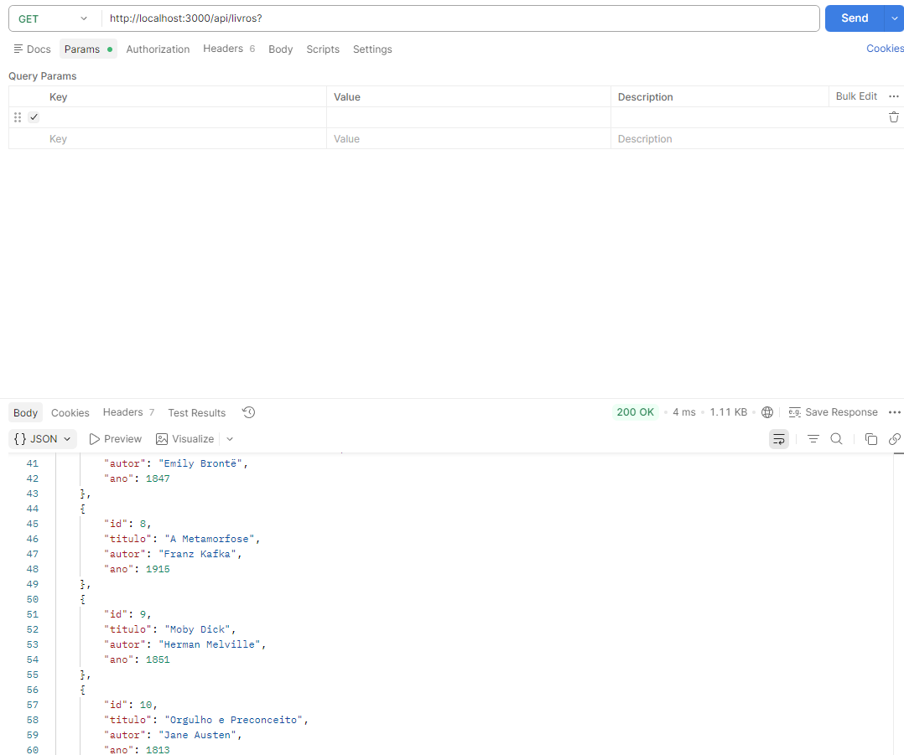
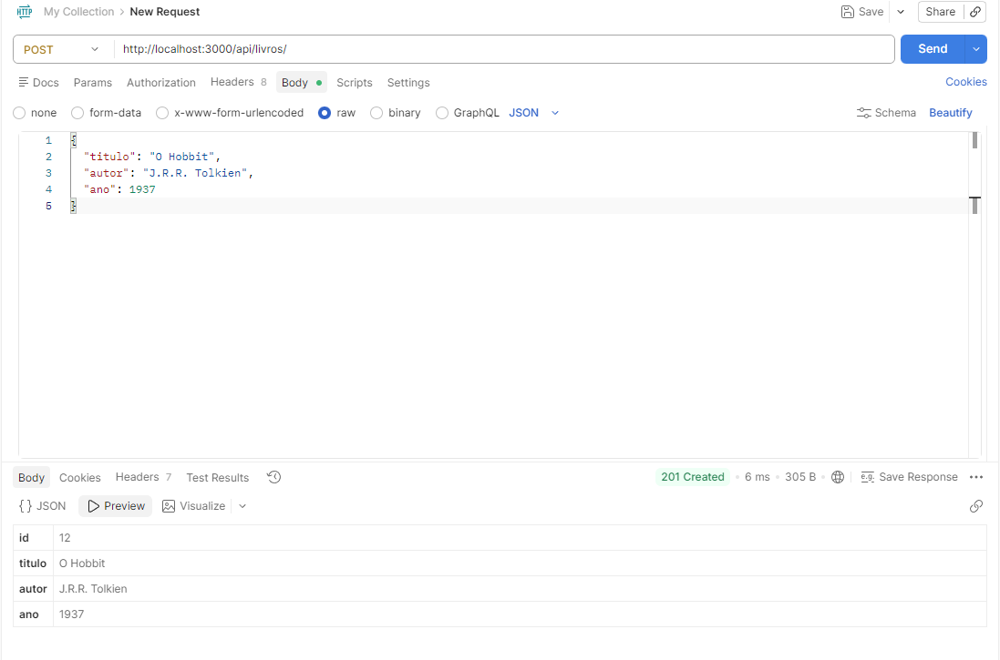
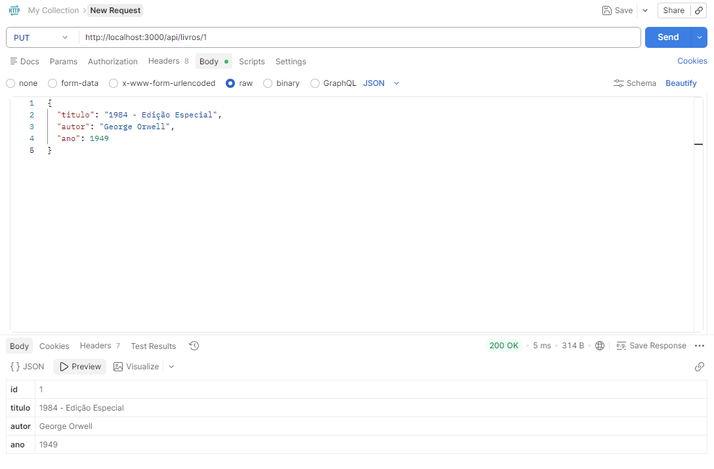
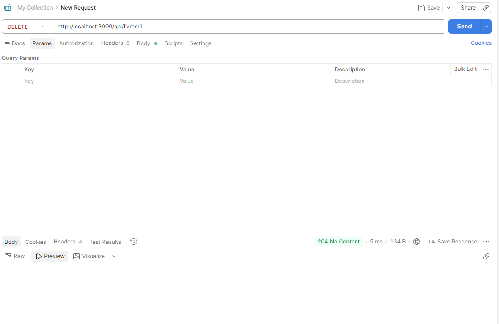

# API CRUD de Livros

## Endpoints

### 1. Listar todos os livros
- **URL:** `/api/livros`
- **Método:** GET
- **Resposta:** Lista de livros em formato JSON.

### 2. Buscar livro por ID
- **URL:** `/api/livros/:id`
- **Método:** GET
- **Resposta:** Livro em formato JSON ou erro 404 se não encontrado.

### 3. Criar novo livro
- **URL:** `/api/livros`
- **Método:** POST
- **Corpo da requisição:** 
```json
{
  "titulo": "Titulo do Livro",
  "autor": "Autor do Livro",
  "ano": 2020
}


# GET




# POST



# PUT


# DELETE
